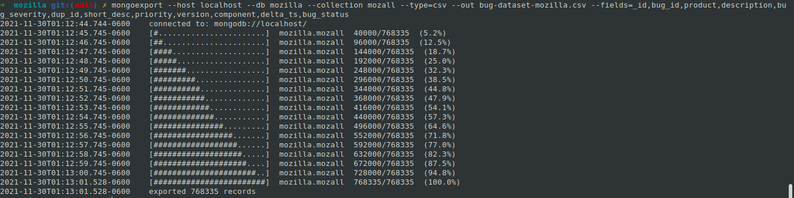
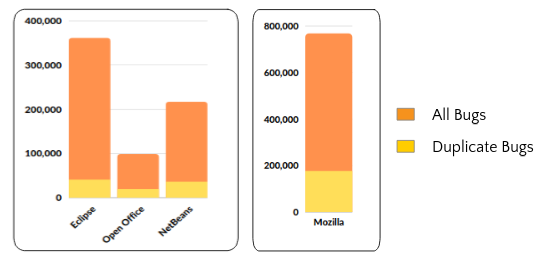
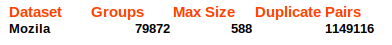
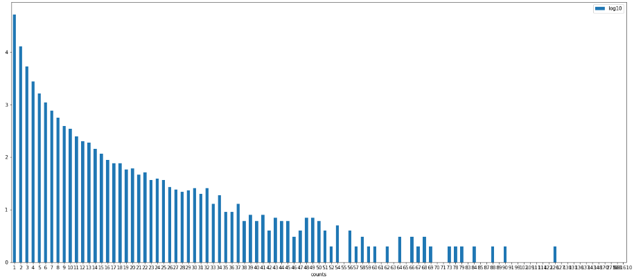

# Duplicate-Bug-Retrieval

### Data
Dataset: http://alazar.people.ysu.edu/msr14data/
> - mongorestore
> - mongo mozilla
> - show collections
> - db.mozall.count()

### Research Questions
- RQ1: Does Accuracy and Recall generalizewell on the new
dataset (Mozilla)?
- RQ 2: Can we deduce some generalizedtrends in bug reports?
If yes, what are theprimary recurring bugs?
- RQ 3: Can some other strategies like attention mechanism
or Tree-LSTM insteadof Bi-LSTM help in improving?
- RQ 4: How efficient is the approach in across-project detec-
tion setting?

### Dataset Preprocessing

#### Exporting the dataset to csv
> convert and export the mongodb database to a csv file
> mongoexport --host localhost --db mozilla --collection mozall --type=csv --out bug-dataset-mozilla.csv --fields=_id,bug_id,product,description,bug_severity,dup_id,short_desc,priority,version,component,delta_ts,bug_status,creation_ts,resolution


#### Cleaning dataset
> - Changing status of non existent duplicate bugs to nonduplicate
> - Changing status of duplicate bugs with empty dup_if to nonduplicate
> - Addressing the cycle problem
> - Removal of OPEN bugs


##### *Number of total and duplicate bugs*



#### Generating Groups
> - Duplicate bugs contribute approx 23% of total bugs
> - Group contains a master bug and set of duplicate bugs

##### *Number of gorups and max size of group*


#### *Histogram of group size*



#### Text Pre-processing Steps
> - Passing through NER Module
> - Removing non alphanumeric characters
> - Text to lower case
> - Tokenization
> - Word Embedding (GloVe Vectors)


### Methodology
#### To prepare the data
```
python3 main.py
```

#### To train the model
```
python3 train_test_model.py
```

### References
[!https://github.com/tqtg/DuplicateBugFinder/tree/0e2e40de6688b62b054c305b30c4d509f9a33824]


